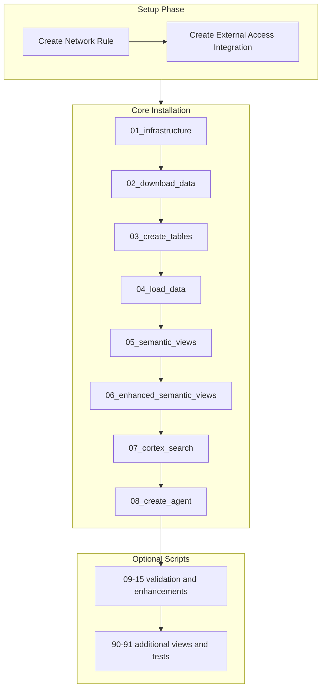

# Plan: Master Installation SQL Script (GitHub)

## Overview

Create a master SQL script (`00_install_all.sql`) that calls all other SQL scripts directly from GitHub using `EXECUTE IMMEDIATE FROM` with raw GitHub URLs.

## GitHub Raw URL Format

```
https://raw.githubusercontent.com/pmjose/Snowflake_AI_Demo_Generic_Telco_streamlit/main/sql_scripts/{filename}.sql
```

## Execution Flow



## Script: [sql_scripts/00_install_all.sql](sql_scripts/00_install_all.sql)

```sql
-- ========================================================================
-- SnowTelco Demo - MASTER INSTALLATION SCRIPT
-- Runs all scripts directly from GitHub
-- Run time: ~20-30 minutes total
-- ========================================================================
-- 
-- INSTRUCTIONS:
-- 1. Run this script as ACCOUNTADMIN
-- 2. Scripts are fetched directly from GitHub (no upload needed)
--
-- ========================================================================

USE ROLE ACCOUNTADMIN;

-- Create network rule for GitHub access
CREATE OR REPLACE NETWORK RULE github_install_rule
  MODE = EGRESS
  TYPE = HOST_PORT
  VALUE_LIST = ('raw.githubusercontent.com:443');

-- Create external access integration
CREATE OR REPLACE EXTERNAL ACCESS INTEGRATION github_install_integration
  ALLOWED_NETWORK_RULES = (github_install_rule)
  ENABLED = TRUE;

-- Set base URL variable
SET github_base = 'https://raw.githubusercontent.com/pmjose/Snowflake_AI_Demo_Generic_Telco_streamlit/main/sql_scripts';

-- ========================================================================
-- CORE INSTALLATION (Required)
-- ========================================================================
SELECT '>>> Starting Core Installation...' AS status;

EXECUTE IMMEDIATE FROM $github_base || '/01_infrastructure.sql';
EXECUTE IMMEDIATE FROM $github_base || '/02_download_data.sql';
EXECUTE IMMEDIATE FROM $github_base || '/03_create_tables.sql';
EXECUTE IMMEDIATE FROM $github_base || '/04_load_data.sql';
EXECUTE IMMEDIATE FROM $github_base || '/05_semantic_views.sql';
EXECUTE IMMEDIATE FROM $github_base || '/06_enhanced_semantic_views.sql';
EXECUTE IMMEDIATE FROM $github_base || '/07_cortex_search.sql';
EXECUTE IMMEDIATE FROM $github_base || '/08_create_agent.sql';

-- ========================================================================
-- VALIDATION & HISTORICAL DATA (Recommended)
-- ========================================================================
SELECT '>>> Loading Historical Data...' AS status;

EXECUTE IMMEDIATE FROM $github_base || '/09_validate_data.sql';
EXECUTE IMMEDIATE FROM $github_base || '/10_load_2025_data.sql';
EXECUTE IMMEDIATE FROM $github_base || '/11_validate_2025_data.sql';
EXECUTE IMMEDIATE FROM $github_base || '/13_load_2024_data.sql';
EXECUTE IMMEDIATE FROM $github_base || '/14_validate_2024_data.sql';

-- ========================================================================
-- ENHANCEMENTS (Optional)
-- ========================================================================
SELECT '>>> Applying Enhancements...' AS status;

EXECUTE IMMEDIATE FROM $github_base || '/12_create_demo_user.sql';
EXECUTE IMMEDIATE FROM $github_base || '/15_data_enhancements.sql';
EXECUTE IMMEDIATE FROM $github_base || '/90_semantic_views_additional.sql';
EXECUTE IMMEDIATE FROM $github_base || '/91_test_semantic_views.sql';

SELECT '>>> Installation Complete!' AS status;
```

## Key Points

1. **Network Access**: Creates network rule and integration for `raw.githubusercontent.com` access

2. **Variable for Base URL**: Uses `$github_base` variable for cleaner code

3. **No Upload Required**: Users just run this one script - everything fetches from GitHub

4. **Progress Messages**: SELECT statements show installation progress

5. **Sectioned**: Core (required) vs Historical/Enhancements (optional) clearly marked