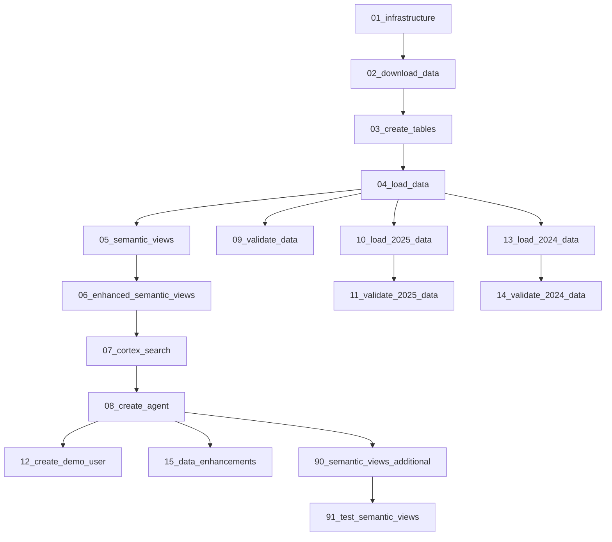

# Plan: Master Installation SQL Script

## Overview

Create a single master SQL script (`00_install_all.sql`) that calls all other SQL scripts in the correct dependency order using Snowflake's `EXECUTE IMMEDIATE FROM` command.

## Execution Order

Based on script headers and dependencies:



## Script: [sql_scripts/00_install_all.sql](sql_scripts/00_install_all.sql)

```sql
-- ========================================================================
-- SnowTelco Demo - MASTER INSTALLATION SCRIPT
-- Runs all installation scripts in the correct order
-- Run time: ~20-30 minutes total
-- ========================================================================
-- 
-- INSTRUCTIONS:
-- 1. Upload all sql_scripts/*.sql files to a Snowflake stage
-- 2. Update @STAGE_PATH below to your stage location
-- 3. Run this script as ACCOUNTADMIN
--
-- ========================================================================

-- Core Installation (Required)
EXECUTE IMMEDIATE FROM @STAGE_PATH/01_infrastructure.sql;
EXECUTE IMMEDIATE FROM @STAGE_PATH/02_download_data.sql;
EXECUTE IMMEDIATE FROM @STAGE_PATH/03_create_tables.sql;
EXECUTE IMMEDIATE FROM @STAGE_PATH/04_load_data.sql;
EXECUTE IMMEDIATE FROM @STAGE_PATH/05_semantic_views.sql;
EXECUTE IMMEDIATE FROM @STAGE_PATH/06_enhanced_semantic_views.sql;
EXECUTE IMMEDIATE FROM @STAGE_PATH/07_cortex_search.sql;
EXECUTE IMMEDIATE FROM @STAGE_PATH/08_create_agent.sql;

-- Validation Scripts (Recommended)
EXECUTE IMMEDIATE FROM @STAGE_PATH/09_validate_data.sql;

-- Historical Data (Optional - adds 2024-2025 data)
EXECUTE IMMEDIATE FROM @STAGE_PATH/10_load_2025_data.sql;
EXECUTE IMMEDIATE FROM @STAGE_PATH/11_validate_2025_data.sql;
EXECUTE IMMEDIATE FROM @STAGE_PATH/13_load_2024_data.sql;
EXECUTE IMMEDIATE FROM @STAGE_PATH/14_validate_2024_data.sql;

-- Enhancements (Optional)
EXECUTE IMMEDIATE FROM @STAGE_PATH/12_create_demo_user.sql;
EXECUTE IMMEDIATE FROM @STAGE_PATH/15_data_enhancements.sql;
EXECUTE IMMEDIATE FROM @STAGE_PATH/90_semantic_views_additional.sql;

-- Testing (Optional)
EXECUTE IMMEDIATE FROM @STAGE_PATH/91_test_semantic_views.sql;
```

## Key Considerations

1. **Stage Path Variable**: Users must update `@STAGE_PATH` to their stage location (e.g., `@SnowTelco_V2.SnowTelco_V2_SCHEMA.SnowTelco_Stage/sql_scripts`)

2. **Role Requirements**: Script starts with `ACCOUNTADMIN` as required by `01_infrastructure.sql`

3. **Sectioned Execution**: Scripts grouped into:
   - Core Installation (01-08) - Required
   - Validation (09, 11, 14) - Recommended
   - Historical Data (10, 13) - Optional
   - Enhancements (12, 15, 90) - Optional
   - Testing (91) - Optional

4. **Progress Messages**: Add SELECT statements between sections to show progress